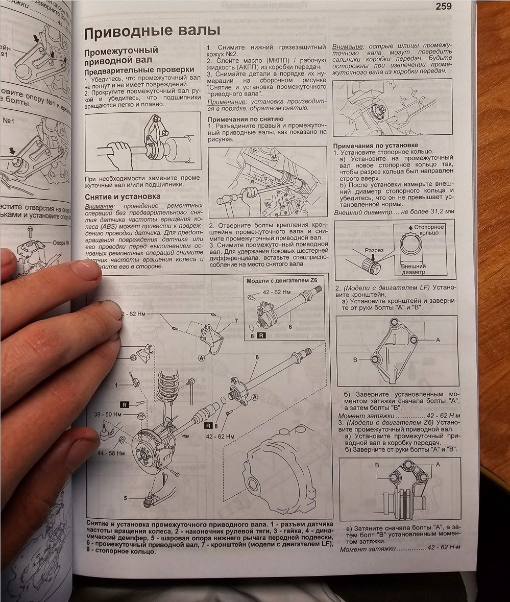

# Сравнение способов сжатия различных расширений изображений

## Рассматриваемые расширения
*Выбирались исходя из поддержки Abbyy FC 12*
- PNG
- JPEG
- PDF

## Образец
В качестве подопытного образца взято изображение:

*Характеристи изображения:*
- Расширение: **jpg**
- Разрешение: **4000 * 3000**
- Объем без сжатия: **3 485 444 байт**

---

## JPEG
*В контексте JPG и JPEG будут считать тождественными*
Размер изображения остаётся неизменным, значение `quality` делаем равным 10. При этом значении уже появляются артефакты, 
но текст еще читаем и различим.

Нужен Pillow

Результат:

*Характеристи изображения:*
- Расширение: **jpeg**
- Разрешение: **4000 * 3000**
- Объем: **429 180 байт**
- разница с оригиналом в %: **-76.24%**

*Возоможные улучшения:*
- уменьшить размер фото + повысить качество

## PNG
Размер изображения остаётся неизменным
Нужен Pillow
Результат:

*Характеристи изображения:*
- Расширение: **png**
- Разрешение: **4000 * 3000**
- Объем: **6 027 333 байт**
- разница с оригиналом в %: **+72.93%**

## PDF (w/o scale)
Без сжатия, получились следующие данные:
- Объем: **3 487 384 байт**
- разница с оригиналом в %: **+0.06%**

## PDF (w scale)
Минусом такого варианта является то, что сначала нужно преобразовать из jpg в pdf и только потом сжимать

Используем [PDF Compressor](https://github.com/theeko74/pdfc).
Ньюанс использования данного способа в том, что Ghostscript распространяется по ком лицензии.
Потерь качества не обнаружено (на глаз).
Сжатие в низком качестве, 150 DPI

- Объем: **1 310 377 байт**
- разница с оригиналом в %: **-62.43%**

